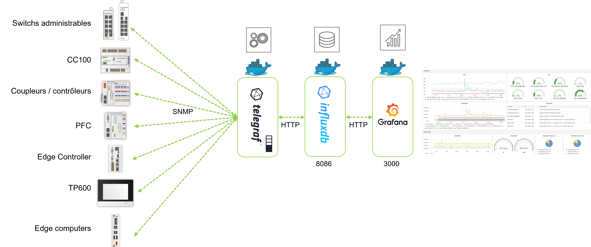
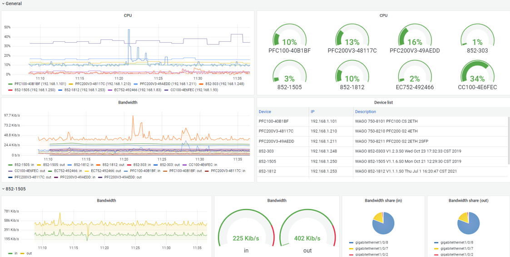
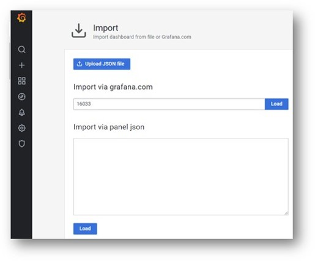
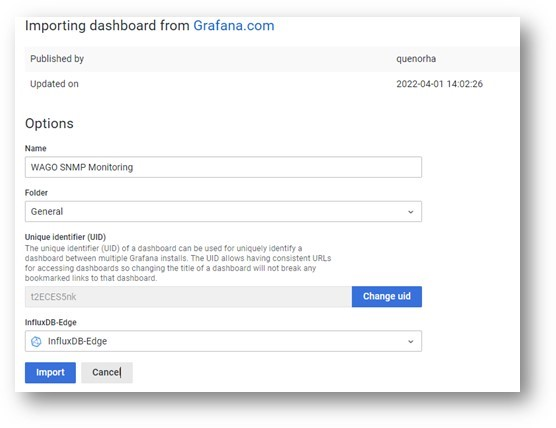

# SNMP Monitoring

## Description

This repo contains all information to set up the monitoring of WAGO Devices in a local network using the SNMP Protocol.
For now it monitors CPU and bandwidth on network interfaces. 
It can be extended by adding other OID and the corresponding panels in the Grafana Dashboard.

<div style="text-align: center">

</div>
<div style="text-align: center">

</div>

## Requirements

You need : 
- an InfluxDB container called "c_influxdb"
- a Grafana Container
	They should both run in a network called "wago" (--net=wago)
	
	On a fresh install you can use WAGO Provisioning Tool : https://github.com/quenorha/wpt
	On an Edge computer : https://github.com/quenorha/mtig_edge

WAGO devices with SNMP agent enabled (SNMP v1/V2C) :
- PFC200 G2
- Touch Panels 600
- Edge Controller
- Compact Controller 100
- Managed Ethernet switches from 852 series
- Edge Computer (you should enable the agent)

## Installation

### Edge computer
On the Edge computer (or other Debian based amd64 devices), you can get the source files and build your own image :
```
mkdir /root/snmp_monitoring
git clone https://github.com/quenorha/snmp_monitoring /root/snmp_monitoring
cd /root/snmp_monitoring
docker build -t wago/telegrafsnmp:1.0 .
```

Then you should edit the /root/snmp_monitoring/telegrafsnmp.conf to match your own setup.
Adapt IP addresses lines 30 ==> WAGO PFC, TP600, Edge Controller, CC100...
Adapt IP addresses lines 68 ==> WAGO Managed Ethernet Switches

Then start the container and provide it the config file :
```
docker run -d --net=wago --restart=unless-stopped --name=c_telegrafsnmp -v /root/snmp_monitoring/telegrafsnmp.conf:/etc/telegraf/telegraf.conf:ro wago/telegrafsnmp:1.0
```

### PFC, TP600, Edge Controller, CC100 (ARM Devices)

Get the config file :

```
wget https://curl.se/ca/cacert.pem -O /root/cacert.pem	# only for <FW20 devices
wget https://raw.githubusercontent.com/quenorha/wpt/main/curlrc -O /root/.curlrc # only for <FW20 devices
curl https://raw.githubusercontent.com/quenorha/snmp_monitoring/main/telegrafsnmp.conf -o /root/snmp_monitoring/telegrafsnmp.conf -s
```

Run the prebuild image (note the "arm" tag in the image name) :
```
docker run -d --net=wago --restart=unless-stopped --name=c_telegrafsnmp -v /root/snmp_monitoring/telegrafsnmp.conf:/etc/telegraf/telegraf.conf:ro quenorha/telegrafsnmp:arm	
```


## Install Grafana Dashboard
In the Grafana Configuration, make sure the datasource is correctly set for InfluxDB, with the "telegraf" database.

Click on + then Import.

Type 16033 in the ID input, then Load.

<div style="text-align: center">

</div>

On InfluxDB-Edge field, select your influxdb datasource containing the telegraf database, click on Import.

<div style="text-align: center">

</div>

(You can also import directly the JSON file "WAGO SNMP Monitoring.json")


## Improvements
Additionnal metrics could be added (memory usage, PoE information,...).
SNMP V3 should be setup in order to provide a secure solution.

